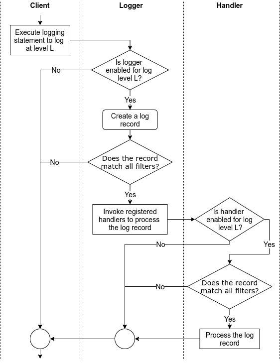

# Python

## Iterable vs Iterator
* iterator is an object that implements the magic `__next__` method
* iterable implements both the `__next__` and `__iter__` (return iterator)

````py
# list_1 is iterable, it can be used in a for-loop
list_1 = range(3)

# iter_list_1 is an iterator, it cannot be used in a for-loop, but can use iter_list_1.next() to iterate
iter_list_1 = iter(list_1)


````

## Enumerate
* Instead of using index to loop a list, use enumerate:
````py
for index, elem in enumerate(a_list):
    print(index, elem)
````

## Enum

* Use `IntEnum` if you need to compare the value of the Enum
* Add `@unique` if the value is unique

## Dict

* Use `defaultdict` for default value during initialization
* Use `namedtuple` for having a tuple-like object, without defining a class. i.e.

````py
from collections import namedtuple

Student = namedtuple("Student", field_names=["name", "age", "scores"])

# Create an instance of the one-line namedtuple class.
student = Student(name="John", age=15, scores=["A", "B", "B", "C", "C", "C"])

# The type is a class.
type(student)
# __main__.Student

# We can access values by indexes like a tuple.
student[0]  # John

# Convert namedtuple to dict using _asdict method
student._asdict()
````

* Use pydantic whenever possible

## Exception Handling
* Be specific as possible
* Print traceback, i.e.
````py
import logging

logger = logging.getLogger()

try:
    num = int("abc")
except ValueError as err:
    logger.exception(err)
````

## Styling
* Use black, mypy, flake, isort to ensure correct linting and styling in place for code
* Set up git hook (pre-commit, commit-msg and pre-push) to ensure code is checked on client side before pushing to remote repo

## Logging
